# TP Relaciones UML 1 a 1 — Implementación Java (Ej. 1–14)

## Cómo compilar y ejecutar
```bash
javac *.java
# correr el demo que quieras
java DemoEj1
java DemoEj2
# ...
java DemoEj14
```

## Checklist del TP
- [x] Implementación de clases con atributos solicitados por ejercicio.
- [x] Relaciones 1 a 1 correctas (asociación / agregación / composición / dependencias).
- [x] Dirección indicada (uni/bidireccional) respetada en el código.
- [x] Clase `DemoEjX` por ejercicio para mostrar instanciación y vinculación.
- [ ] Diagramas UML (requeridos por el enunciado). **Incluyo abajo _Mermaid_** para que puedas pegarlo en https://mermaid.live o VSCode y exportar a PNG/PDF.
- [ ] Documento breve con tabla “Ejercicio — Tipo de relación — Dirección” (podés copiar la tabla inferior).

> Nota: si el profe exige paquetes (`package`) o nombres exactos de clases, avisame y lo adapto.

## Tabla resumen
| Ejercicio | Relación principal | Dirección |
|---|---|---|
| 1 | Composición (Pasaporte→Foto), Asociación (Pasaporte↔Titular) | Uni y Bi |
| 2 | Agregación (Celular→Batería), Asociación (Celular↔Usuario) | Uni y Bi |
| 3 | Asociación (Libro→Autor), Agregación (Libro→Editorial) | Uni |
| 4 | Asociación (Tarjeta↔Cliente), Agregación (Tarjeta→Banco) | Bi |
| 5 | Composición (Computadora→Placa), Asociación (Computadora↔Propietario) | Bi |
| 6 | Asociación (Reserva→Cliente), Agregación (Reserva→Mesa) | Uni |
| 7 | Agregación (Vehículo→Motor), Asociación (Vehículo↔Conductor) | Bi |
| 8 | Composición (Documento→Firma), Agregación (Firma→Usuario) | Uni |
| 9 | Asociación (Cita→Paciente, Cita→Profesional) | Uni |
| 10 | Composición (Cuenta→Clave), Asociación (Cuenta↔Titular) | Bi |
| 11 | Dependencia de uso (Reproductor.reproducir(Cancion)) | Uso |
| 12 | Dependencia de uso (Calculadora.calcular(Impuesto)) | Uso |
| 13 | Dependencia de creación (GeneradorQR.generar(...)) | Creación |
| 14 | Dependencia de creación (EditorVideo.exportar(...)) | Creación |

## Diagramas (Mermaid)

### Ej1
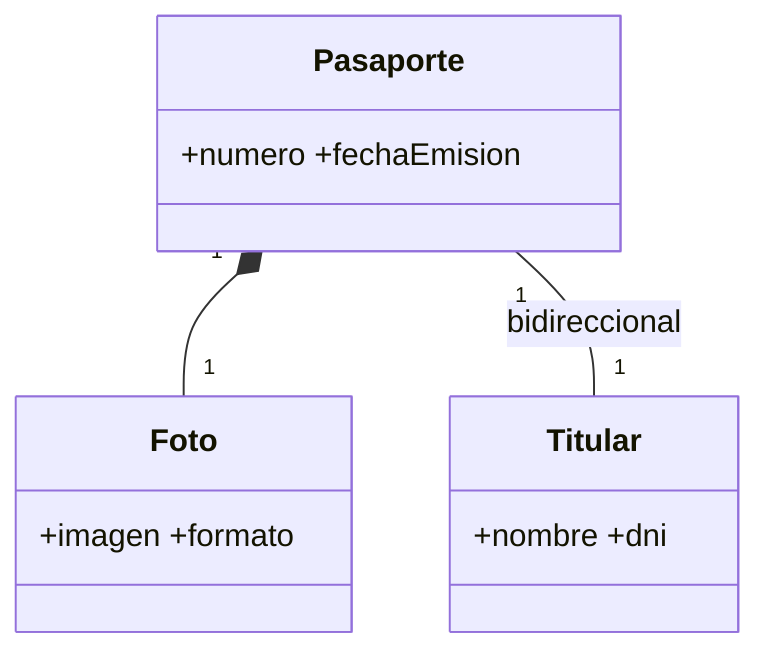

### Ej2
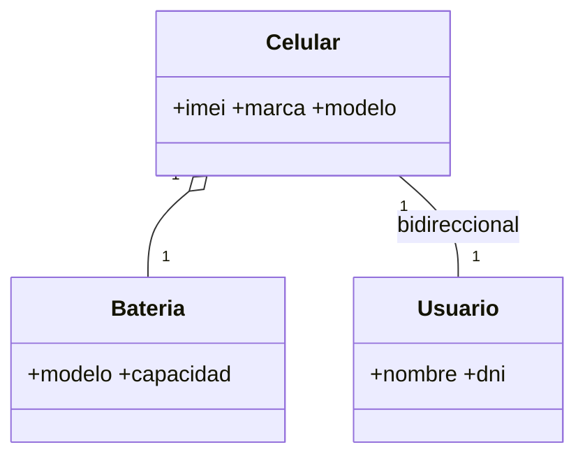

### Ej3
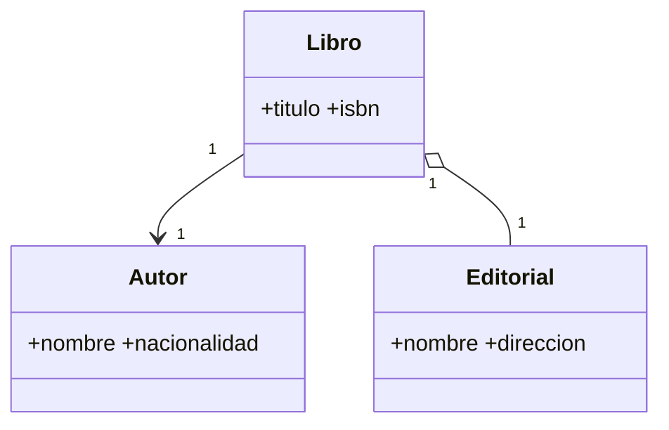

### Ej4
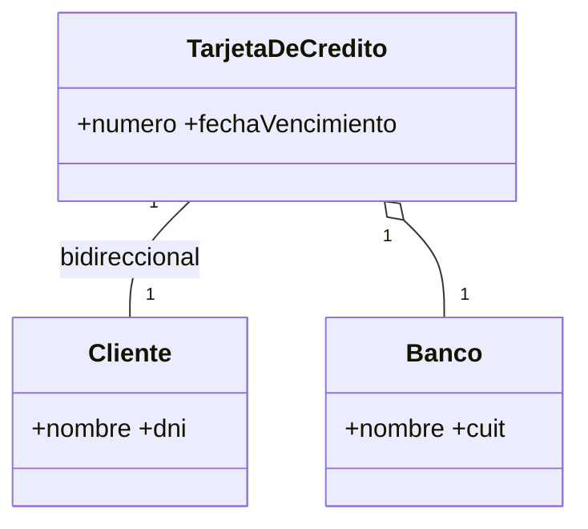

### Ej5
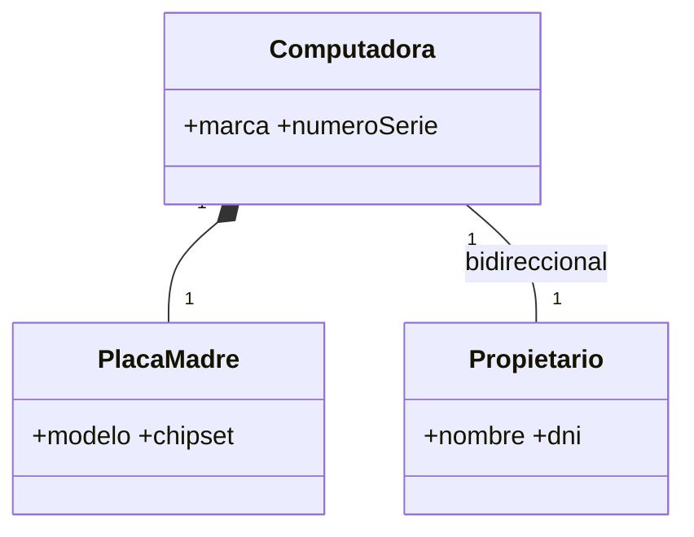

### Ej6
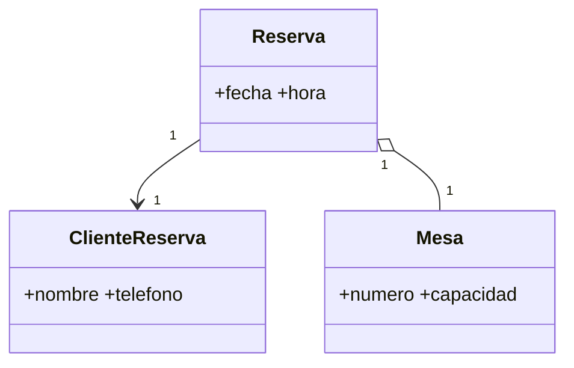

### Ej7
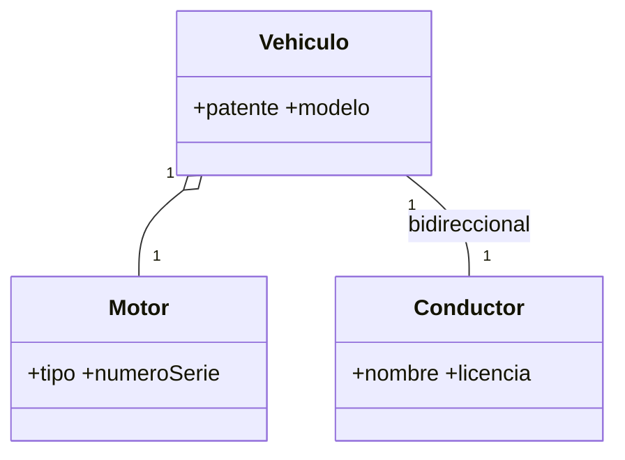

### Ej8
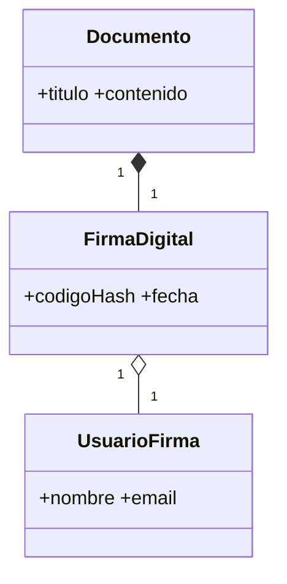

### Ej9
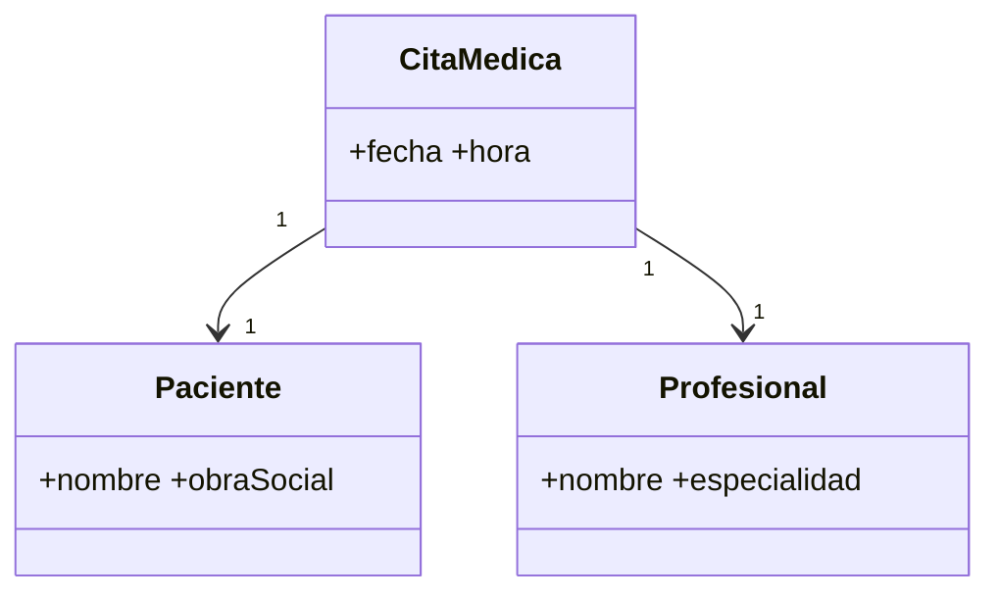

### Ej10
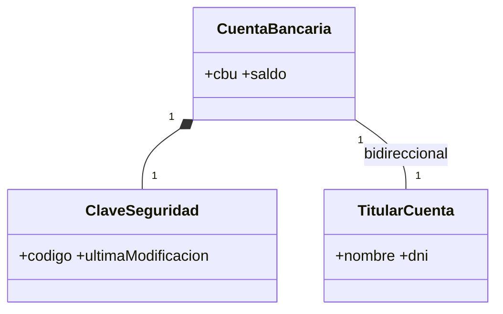

### Ej11 (dependencia de uso)
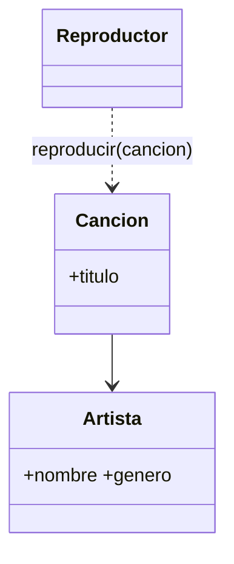

### Ej12 (dependencia de uso)
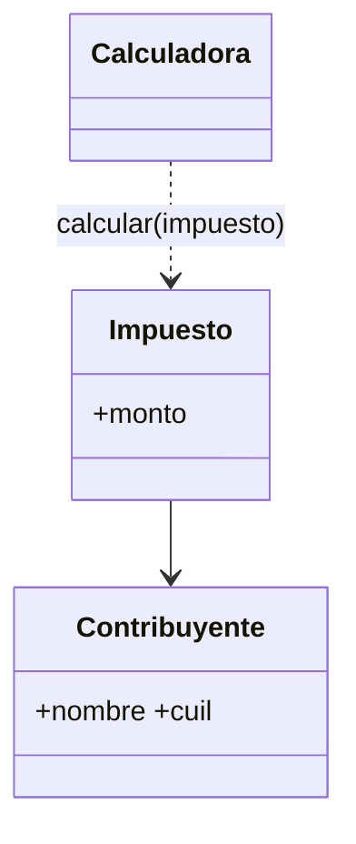

### Ej13 (dependencia de creación)
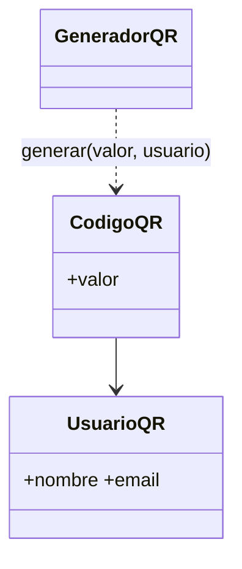

### Ej14 (dependencia de creación)
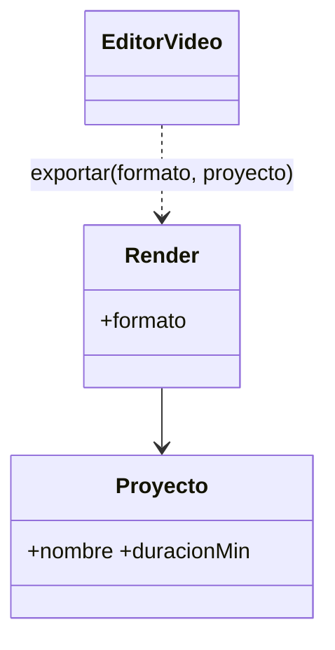
